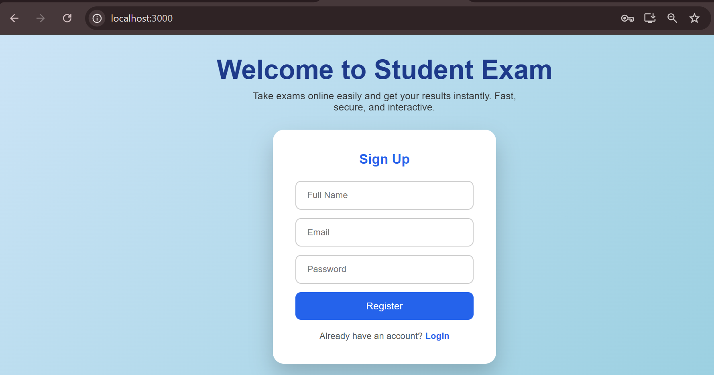

# Exam Portal

A full-stack student exam application (student-side only) built for LeadMasters AI Tech Solutions fresher selection assessment.  

Features include:
- User registration and login with JWT authentication
- Randomized exam questions
- Multiple-choice questions with Next/Previous navigation
- Countdown timer with auto-submit
- Exam submission and score calculation
- Result display page

## Technology Stack

**Frontend:** React.js  
**Backend:** Node.js with Express.js  
**Database:** MongoDB  
**Authentication:** JWT

## Setup Instructions

1. Clone the repository:
   git clone https://github.com/Rakesh07804/exam_app.git
   
   cd student_exam_assignment

3. Install backend dependencies:
cd backend

npm install

5. Set up `.env` in backend:

6. Run backend:
node server.js

7. Install frontend dependencies:
cd ../frontend

npm install

npm start

9. Open the browser at `http://localhost:3000`.

## API Testing

All APIs tested using Thunder/Postman.  

- **Register User:** POST `/api/user/register`  
- **Login User:** POST `/api/user/login`  
- **Get Questions:** GET `/api/exam/questions` (JWT required)  
- **Submit Exam:** POST `/api/exam/submit` (JWT required)  
- **Get Result:** GET `/api/exam/result/:id` (JWT required)  

See `APITests.txt` for all test cases and payloads.

## Screenshots

**Register/Login Page**  
  
  

**Exam Page**  
  

**Result Page**  

